# Car Damage Classification

A small application based on TensorFlow and Keras for classifying car damage properties on images.

## Technologies

- TensorFlow/Keras
- SciKit Learn
- CUDA/cuDNN

## Local Development

### Dependencies
- CUDA compatible graphics card
- CUDA and cuDNN installed
- Access to TF-Hub to fetch pretrained models OR pretrained models locally at ./keras/models/~
- Python Environment configured
  ```sh
  pip install -r requirements.txt
  ```
## Run Car Damage Application
- Adjust application_config.json to point to correct model files
- Update label files accordingly
```sh
  python main.py --config <path/to/your/application_config.json> --debug False
```

# Training Results

Training was done using cross validation. We report accuracy results for each iteration here. A more detailed results for each label can be found with each model inside a results.txt file.\
Each image shows two curves (blue: training set, orange: validation set). In
case of multi-class classification accuracy is measured with CategoricalAccuracy and loss with
CategoricalCrossentropy. In case of multi-label classification accuracy is measured with
BinaryAccuracy and loss with BinaryCrossentropy.

## ResNet50V2

Model available [over dropbox](https://www.dropbox.com/s/l84erw0vlisdzmn/ResNet50V2.rar?dl=0)

### Damage Severity

Categorical accuracies for cross validation splits:  
[0.7260273694992065, 0.7424657344818115, 0.7369862794876099, 0.7041096091270447, 0.7178082466125488]

on average: 0.7254794478416443  
best iteration: 2

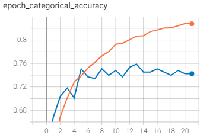
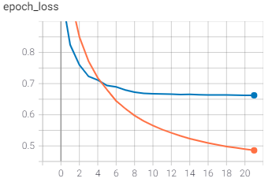

### Location

Binary accuracies for cross validation splits:   
[0.8404109477996826, 0.8472602963447571, 0.8390411138534546, 0.8500000238418579, 0.8547945022583008]

on average: 0.8463013768196106  
best iteration: 5

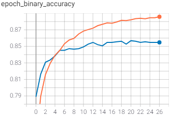
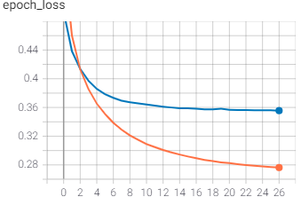

### Damage Type

Binary accuracies for cross validation splits:  
[0.8668494820594788, 0.8728767037391663, 0.8586300611495972, 0.8767123222351074, 0.8717808723449707]

on average: 0.8693698883056641  
best iteration: 4

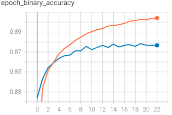
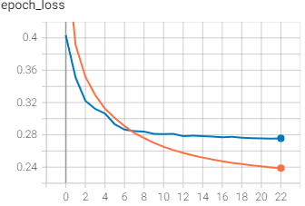

## MobileNet

Model available [over dropbox](https://www.dropbox.com/s/685bhfvphemf0el/MobileNet.rar?dl=0)

### Damage Severity

Categorical accuracies for cross validation splits:  
[0.7561643719673157, 0.7890411019325256, 0.7643835544586182, 0.7561643719673157, 0.7561643719673157]  

on average: 0.7643835544586182  
best iteration: 2

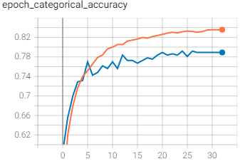
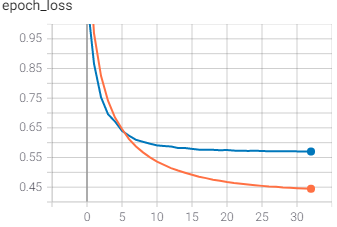

### Location

Binary accuracies for cross validation splits: 
[0.8773972392082214, 0.8623287677764893, 0.8554794788360596, 0.8609589338302612, 0.8589041233062744]

on average: 0.8630137085914612  
best iteration: 1

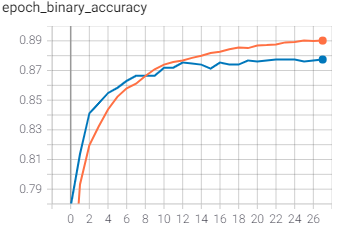
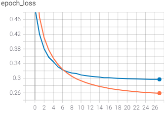

### Damage Type

Binary accuracies for cross validation splits:   
[0.8898629546165466, 0.8783560991287231, 0.8712328672409058, 0.8926026821136475, 0.8799999356269836]

on average: 0.8824109077453614  
best iteration: 4

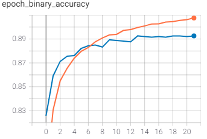
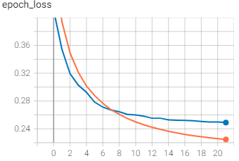
